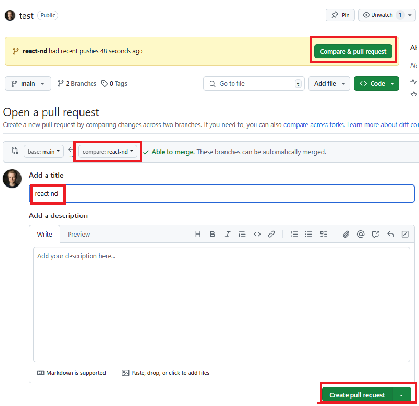

# Namų darbų pateikimo tvarka

Pastaba: 1. ir 2. žingsnius galite praleisti, jei jau turite repozitoriją

## Eiga
1. Sukurkite repozitorija: github.com  

2. Atsidarome terminalą ir parsisiunčiame repozitoriją:
```bash
  $git clone 'https:// ...  jusu repozitorijos nuoroda ....'
```
3. Atsidarome terminalą ir sukuriame naują šaką (būdami repozitorijos direktorijos viduje) 
  komanda: $git checkout -b <šakos_pavadinimas>
  pvz.:
  ```bash
    $git checkout -b react-nd
  ```

4. Failus įkeliame į aplanką pavadinimu 'react-nd' (tikrinsiu tik failus, kurie bus aplanke 'react-nd')

5. Sukuriame commit'ą  su tekstu apibūdinančių jūsų darbą
  ```bash
    $git add .
    $git commit -m 'react-nd'
  ```

6. Pa'push'iname savo šaką
  ```bash
    $git push
  ```


7. Kuriame pull request'ą savo repozitorijoje:



8. Naviguojame į sukurtą Pull Request'ą, repozitorijoje kopijuojame nuorodą ir atsiunčiame į MS Teams, tikrintojui į chatą

